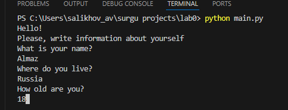
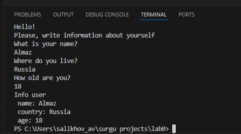

## Задание

Написать программу для сбора информации от пользователя, а именно: имя, страна, возраст

## Исходный код 
```
userInfo = []

print("Hello!\nPlease, write information about yourself")

print("What is your name?")
name = str(input())
while not name:
    print("What is your name?")
    name = str(input())
userInfo.append(name)

print("Where do you live?")
country = str(input())
while not country:
    print("Where do you live?")
    country = str(input())
userInfo.append(country)

print("How old are you?")
age = str(input())
while not country:
    print("How old are you?")
    age = str(input())
userInfo.append(age)

print(
    "Info user\n",
    f"name: {userInfo[0]}\n",
    f"country: {userInfo[1]}\n",
    f"age: {userInfo[2]}"
)
```

## Результаты выполнения кода

**Запрос и ввод имени пользователя**


**Запрос и ввод страны пользователя**


**Запрос и ввод возраст пользователя**



**Вывод информации о пользователе**




## Список использованных источников:
1. [Markdown Cheat Sheet](https://www.markdownguide.org/cheat-sheet/)
2. [report_demo](https://github.com/still-coding/report_demo)