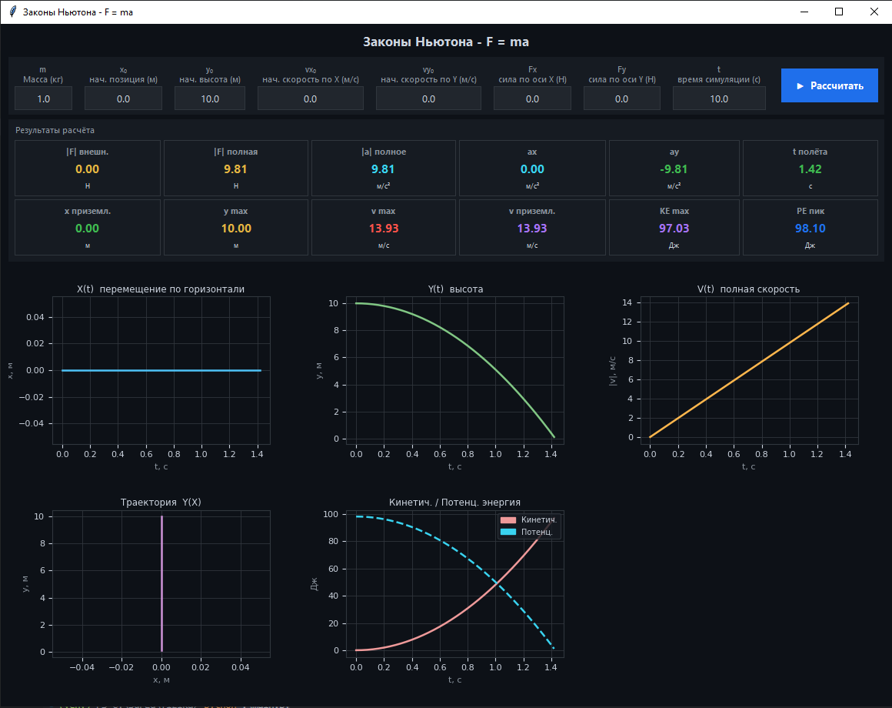

# Законы Ньютона - F = ma

**Симулятор движения тела под действием сил**

| | |
|---|---|
| **Язык программирования** | Python 3.13 |
| **Основные библиотеки** | `tkinter`, `numpy`, `matplotlib` |
| **Тип приложения** | Desktop GUI |
| **Физическая модель** | Равноускоренное движение (2D) |

---

## Описание

Проект «Законы Ньютона - F = ma» представляет собой интерактивное настольное приложение на Python для симуляции и визуализации движения тела под действием заданных сил с учётом земного притяжения.

### Цели проекта

- Наглядная демонстрация второго закона Ньютона: **F = ma**
- Симуляция траектории движения тела в двумерном пространстве
- Интерактивный ввод начальных условий (масса, скорости, силы, время)
- Визуализация ключевых физических зависимостей на графиках
- Расчёт и отображение энергетических характеристик движения

### Функциональность

Пользователь задаёт начальные параметры через графический интерфейс: массу тела `m`, начальные координаты `x0, y0`, начальные скорости `vx0, vy0`, составляющие внешней силы `Fx, Fy` и время симуляции. Нажатие кнопки **«Рассчитать»** запускает вычисления и мгновенно обновляет пять графиков, а также панель числовых результатов из 12 физических величин.

---

## Установка и запуск

```bash
# Установка зависимостей
pip install numpy matplotlib

# Запуск
python main.py
```

> `tkinter` входит в стандартную библиотеку Python. Если отсутствует - установите через `sudo apt install python3-tk` (Linux).

---

## Основная логика

### Ключевые функции

- **`simulate()`** - физическое ядро: вычисляет кинематику и энергии методом аналитического решения уравнений движения
- **`draw_graphs()`** - визуализация: отрисовывает пять графиков с помощью matplotlib

### Физический алгоритм

```python
def simulate(mass, x0, y0, vx0, vy0, fx, fy, t_end, dt=0.01):
    t  = np.arange(0, t_end + dt, dt)
    ax = fx / mass
    ay = fy / mass - 9.81

    x  = x0  + vx0 * t + 0.5 * ax * t**2
    y  = y0  + vy0 * t + 0.5 * ay * t**2
    vx = vx0 + ax * t
    vy = vy0 + ay * t
    v  = np.sqrt(vx**2 + vy**2)

    KE = 0.5 * mass * v**2
    PE = mass * 9.81 * y

    # Обрезка траектории при касании земли
    ground = np.where(y < 0)[0]
    if len(ground) > 0 and ground[0] > 0:
        s = ground[0]
        t, x, y, vx, vy, v, KE, PE = (
            t[:s], x[:s], y[:s],
            vx[:s], vy[:s], v[:s],
            KE[:s], PE[:s],
        )
    return t, x, y, vx, vy, v, KE, PE
```

### Применённые формулы

| Параметр | Формула | Пояснение |
|---|---|---|
| Ускорение по X | `ax = Fx / m` | Второй закон Ньютона |
| Ускорение по Y | `ay = Fy/m - 9.81` | С учётом гравитации |
| Координата X(t) | `x = x0 + vx0·t + ½·ax·t²` | Кинематика (аналит.) |
| Координата Y(t) | `y = y0 + vy0·t + ½·ay·t²` | Кинематика (аналит.) |
| Полная скорость | `v = √(vx² + vy²)` | Вектор скорости |
| Кинетич. энергия | `KE = ½·m·v²` | Закон сохранения |
| Потенц. энергия | `PE = m·g·y` | Потенциальная энергия |

---

## Параметры по умолчанию

При запуске программы автоматически выполняется расчёт с параметрами по умолчанию (свободное падение тела массой 1 кг с высоты 10 метров в течение 10 секунд).

| Параметр | Значение |
|---|---|
| Масса (m) | 1 кг |
| Начальная позиция (x0, y0) | 0 м ; 10 м |
| Начальная скорость (vx0, vy0) | 0 м/с ; 0 м/с |
| Внешняя сила (Fx, Fy) | 0 Н ; 0 Н |
| Время симуляции | 10,0 с |

---

## Результат работы программы при параметрах по умолчанию



## Авторы

- Салихов Алмаз Вилевич - гр. 601-51
- Ядрышников Данила Дмитриевич - гр. 601-51

**Руководитель:** Семенов О.Ю.

Сургутский государственный университет, 2026
